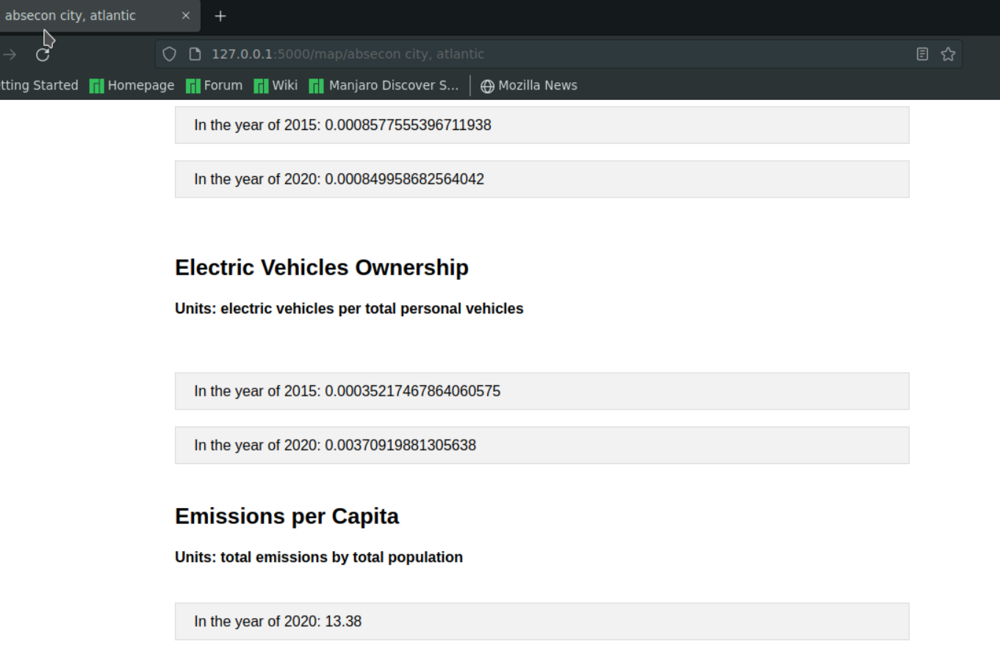
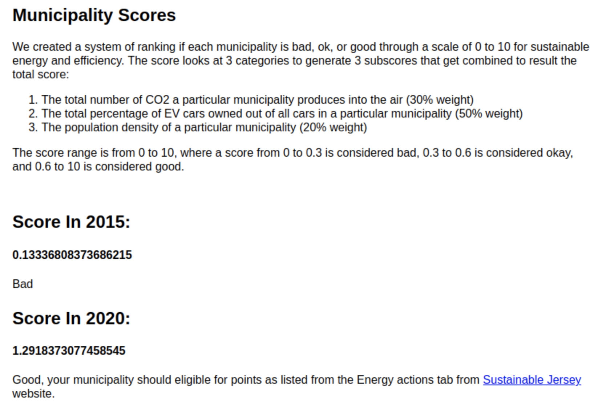
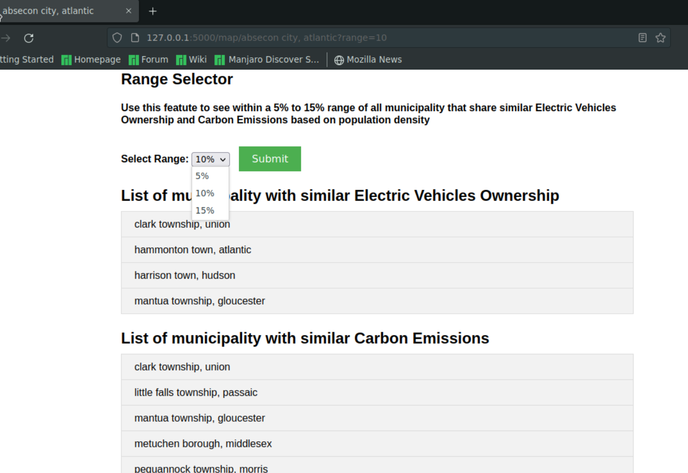

# How does the website work? 
## GUI Figures (Graphical User Interface)
> Note: Please click on the figures to enlarge the image
### Figure 1: This is the website's landing page, and now you must read the directions on this page to start using our project!


### Figure 2: This is the website's search and select municipalities page, and now you must read the directions on this page to get to the fun stuff!


### Figure 3: This page on the website shows all the stats and queries we did to find trends, and patterns from our database for each selected municipality.


### Figures 4 to 5: Shows all the values we calculated to find population density, square miles per person, ev car ownership and emissions per capita.




### Figure 6: The score is calculated between a range of 0 to 1. The figure below explains how we rank the municipality if it is sustainable and effiencent in their energy useage.  
> The way that the scores are calculated can be shown as high level pseudocode below:
```
for i in range(len(values in the CO2 emission column)): #Comment: Loop through one column, it does matter which since they all have the same length 
  co2score = i / MAX(co2 emission column) * 3 #Comment: Divide this current value by the max
  evCarScore = i / MAX(ev car column) * 5 #Comment: Divide this current value by the max
  popDensityScore = i / MAX(population density column) #Comment: Divide this current value by the max score = co2score + evCarScore + popDensityScore
```



### Figures 7 to 8: This shows the all the types of cars that people own in the municipality.
* To use this feature click on the little arrow on the left-hand side of the term 'Car Brand' and you can see the list of the car brands. To close this list hit the little arrow again. 


### Figures 9 to 11: This shows the range of all municipalities that share similar ev car ownership, and carbon emissions based on population density data.
* To use this feature click on the dropdown table and selected the desired range then hit submit to see the new results 
> Note: There is a slight bug here, we can only see if the selected range was submitted corrected in the url. Otherwise on the dropdown table it always shows as 5% even though a different range like 10% was selected and the 10% data is currently being displayed.




